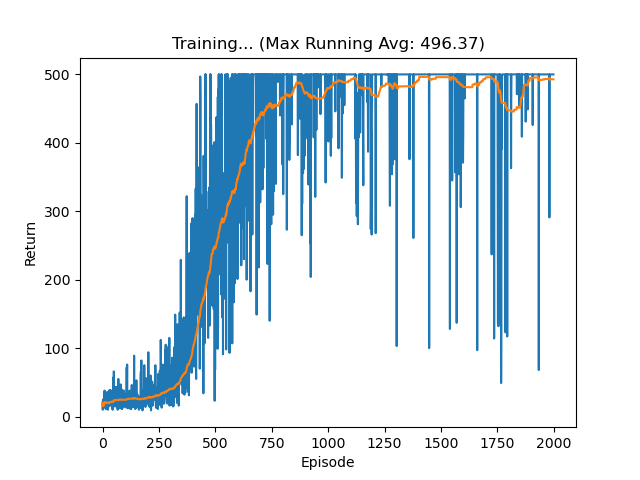

# AI4023 Deep Reinforcement Learning - Project 2 Report

**Student ID**: 2230026047  何炯乐

---

## 1. Overview

In this project, we implement three policy gradient algorithms:

- **REINFORCE**: A Monte Carlo policy gradient method
- **n-step A2C (Advantage Actor-Critic)**: An actor-critic method with n-step bootstrapping
- **PPO-Clip (Proximal Policy Optimization)**: A clipped surrogate objective method

All algorithms are tested on **CartPole-v1** (discrete action space) and **Pendulum-v1** (continuous action space). The python GYM is tooooooooooo old! So replacing it with gymnasium is necessary. :) 

---

## 2. Section I: REINFORCE and A2C

### 2.1 REINFORCE Implementation

The REINFORCE algorithm approximates the policy gradient using Monte Carlo returns:

$$\nabla_{\theta} J(\theta) \approx \frac{1}{N} \sum_{i=1}^{N} \left( \sum_{t=0}^{T} \gamma^{t} \nabla_{\theta} \log \pi_{\theta}(a_{i,t} | s_{i,t}) \cdot G_t \right)$$

where $G_t = \sum_{t'=t}^{T} \gamma^{t'-t} r_{t'}$ is the Monte Carlo return.

**Pseudocode:**
```
Algorithm: REINFORCE
1. Initialize policy network π_θ
2. For each episode:
    a. Generate trajectory τ = (s_0, a_0, r_0, ..., s_T, a_T, r_T) using π_θ
    b. Compute returns for each timestep:
       For t = 0 to T:
           G_t = Σ_{k=t}^{T} γ^{k-t} r_k
    c. Compute policy gradient loss:
       loss = -Σ_t log π_θ(a_t|s_t) · G_t
    d. Update θ using gradient descent
3. Repeat until convergence
```

**Key implementation details:**
- `GaussianPolicyNet.forward()`: For continuous action spaces (Pendulum), outputs mean and log_std, samples action, computes log_prob
- `CategoricalPolicyNet.forward()`: For discrete action spaces (CartPole), outputs action probabilities, samples action, computes log_prob
- `REINFORCEAgent.step()`: Collects full episode trajectory, computes discounted returns $G_t$, and updates policy using $\log \pi \cdot G_t$

### 2.2 A2C Implementation

The n-step A2C uses the advantage function:

$$A_t = G_t^{(n)} - V(s_t)$$

where the n-step return is:

$$G_t^{(n)} = r_t + \gamma r_{t+1} + \dots + \gamma^{n-1}r_{t+n-1} + \gamma^n V(s_{t+n})$$

**Pseudocode:**
```
Algorithm: n-step A2C
1. Initialize actor network π_θ and critic network V_φ
2. For each iteration:
    a. Collect n-step rollout:
       For i = 1 to n:
           Sample a_i ~ π_θ(·|s_i)
           Execute a_i, observe r_i, s_{i+1}
           Store (s_i, a_i, r_i, log_prob_i)
    b. Compute bootstrap value: V(s_n) if non-terminal, else 0
    c. Compute n-step returns (backwards):
       R = V(s_n)
       For t = n-1 down to 0:
           R = r_t + γR
           A_t = R - V(s_t)    (advantage)
    d. Compute losses:
       policy_loss = -Σ_t log_prob_t · A_t
       value_loss = Σ_t (V(s_t) - R)²
       total_loss = policy_loss + c · value_loss
    e. Update θ, φ using gradient descent
3. Repeat until convergence
```

**Key implementation details:**
- `GaussianActorCriticNet.forward()` / `CategoricalActorCriticNet.forward()`: Output action, log_prob, and value estimate
- `A2CAgent.step()`: Collects n-step rollout, computes n-step returns with bootstrapping, computes advantage $A_t = G_t^{(n)} - V(s_t)$, and updates both policy and value networks

### 2.3 CartPole-v1 Results

#### Training Return


#### Policy Loss


#### Value Loss (A2C only)


**Final Evaluation Return**: A2C achieves stable return of ~200.0 on CartPole-v1.

### 2.4 Pendulum-v1 Results

#### Training Return (REINFORCE vs A2C)


#### Policy Loss
- REINFORCE Policy Loss: See `section_1/data/REINFORCEAgent_Pendulum-v1_260530-224947/policy_loss.png`
- A2C Policy Loss: See `section_1/data/A2CAgent_Pendulum-v1_260530-224947/policy_loss.png`

#### Value Loss (A2C only)


### 2.5 REINFORCE vs A2C Comparison

| Aspect | REINFORCE | A2C |
|--------|-----------|-----|
| Variance | High (full Monte Carlo returns) | Lower (advantage function reduces variance) |
| Convergence Speed | Slower | Faster |
| Stability | Less stable, high variance | More stable due to baseline (value function) |
| Sample Efficiency | Lower (waits for full episode) | Higher (n-step bootstrapping) |

**Key observations:**
- A2C converges faster and more stably than REINFORCE due to the advantage function $A_t = G_t^{(n)} - V(s_t)$, which reduces variance by subtracting the value baseline.
- REINFORCE suffers from high variance in gradient estimates, especially in continuous action spaces like Pendulum.
- The n-step bootstrapping in A2C provides a balance between bias and variance, leading to better sample efficiency.

---

## 3. Section II: PPO-Clip Implementation

### 3.1 Algorithm

PPO-Clip uses the following clipped surrogate objective:

$$L^{CLIP}(\theta) = \mathbb{E}_t\left[\min\left(r_t(\theta)\hat{A}_t,\ \mathrm{clip}(r_t(\theta),1-\epsilon,1+\epsilon)\hat{A}_t\right)\right]$$

where:
- $r_t(\theta) = \frac{\pi_\theta(a|s)}{\pi_{\theta_{old}}(a|s)}$ is the probability ratio
- $\hat{A}_t$ is the Monte Carlo advantage estimate
- $\epsilon$ is the clipping parameter

Value Loss: $\mathbb{E}_t[(V_\phi(s) - \hat{V}(s))^2]$

**Pseudocode:**
```
Algorithm: PPO-Clip
1. Initialize policy network π_θ and value network V_φ
2. For each iteration:
    a. Collect trajectory for T timesteps:
       Store (s_t, a_t, r_t, log_prob_old_t, V(s_t))
    b. Compute Monte Carlo returns and advantages:
       advantage_t = Σ_{l=t}^{T} γ^{l-t} r_l - V(s_t)
       return_t = Σ_{l=t}^{T} γ^{l-t} r_l
    c. For K epochs:
       Shuffle and divide data into minibatches
       For each minibatch:
           ratio = exp(log π_θ(a|s) - log_prob_old)  (π_θ/π_θ_old)
           clipped_ratio = clip(ratio, 1-ε, 1+ε)
           policy_loss = -min(ratio·advantage, clipped_ratio·advantage)
           value_loss = (V_φ(s) - return)²
           Update θ, φ using gradient descent
3. Repeat until convergence
```

**Key implementation details:**
- Collect trajectory for multiple episodes
- Compute Monte Carlo returns and advantages
- Perform multiple epochs of minibatch updates
- Use `.detach()` to prevent gradient leakage for old log_probs and advantages
- Clip the probability ratio to prevent too large policy updates

### 3.2 CartPole-v1 Results



**Performance**: PPO-Clip achieves a score of 500.0 consistently in the later episodes.

**Maximum Running Average within 2000 episodes**: ~500.0

**PPO Score**: $\min\left(\frac{\text{max running average}}{475}, 1\right) \times 100\% \approx 100\%$

### 3.3 Hyperparameters

| Parameter | Value |
|-----------|-------|
| Learning Rate | 0.0003 |
| Gamma (discount) | 0.99 |
| Epsilon (clip) | 0.2 |
| Epochs per update | 10 |
| Minibatch size | 32 |
| Horizon (T) | 2048 |

---

## 4. Conclusion

- **REINFORCE** is simple but suffers from high variance, making it less practical for complex environments.
- **A2C** improves upon REINFORCE by introducing a value function baseline and n-step bootstrapping, leading to faster and more stable convergence.
- **PPO-Clip** provides the most stable training by limiting the magnitude of policy updates through clipping, achieving near-optimal performance on CartPole-v1.

All three algorithms were successfully implemented and tested on both discrete (CartPole-v1) and continuous (Pendulum-v1) action spaces.